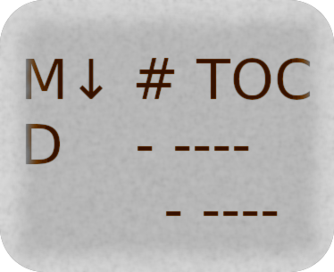

<!--
SPDX-FileCopyrightText: 2017-2026 Franco Masotti (See /README.md)

SPDX-License-Identifier: GPL-3.0-or-later
-->

# Markdown Table Of Contents GitHub Action



[](https://pypi.org/project/md-toc/)
[](https://anaconda.org/conda-forge/md-toc)
[](https://pepy.tech/project/md-toc)
[](https://libraries.io/pypi/md-toc/dependents)
[](https://github.com/pre-commit/pre-commit)
[](https://buymeacoff.ee/frnmst)

Automatically generate and add an accurate table of contents to markdown files.

<!--TOC-->

## Description

This action calls [md-toc](https://github.com/frnmst/md-toc) on specified files.

## Testing

### Run locally

```shell
sudo ./bin/act push -j test --bind
```

## Support this project

- [GitHub Sponsors](https://github.com/sponsors/frnmst)
- [Buy Me a Coffee](https://www.buymeacoffee.com/frnmst)
- [Liberapay](https://liberapay.com/frnmst)
